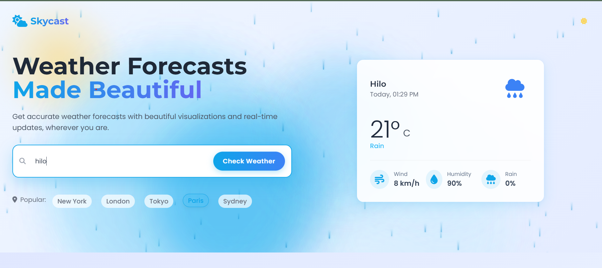
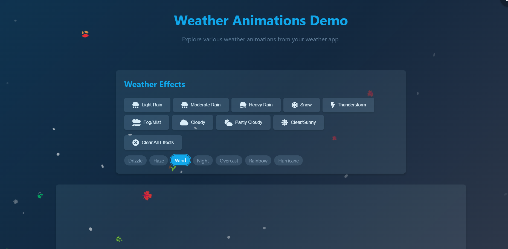
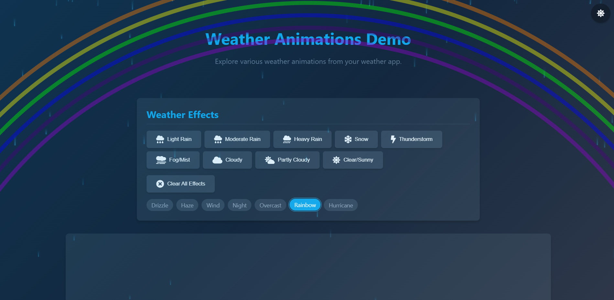
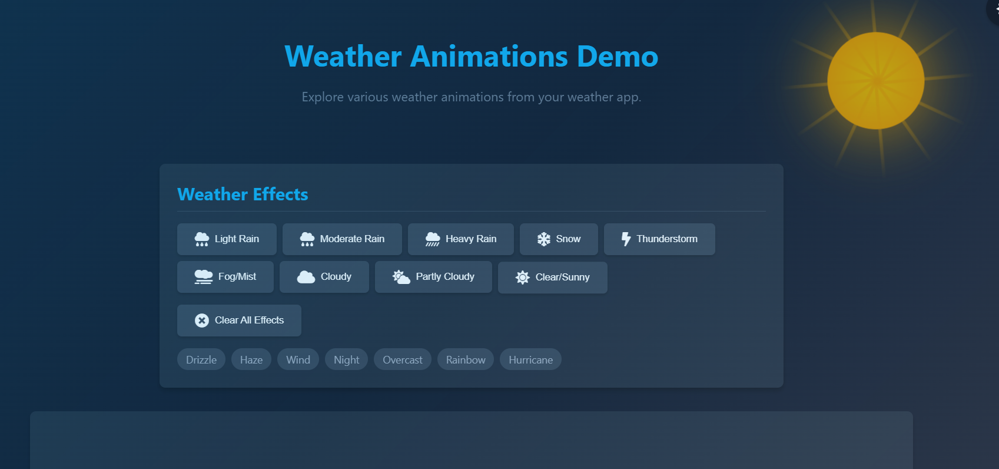

# Skycast - Beautiful Weather Forecasting App

Skycast is a visually stunning weather forecasting web application built with HTML, CSS, and JavaScript. It features beautiful animations, responsive design, and real-time weather data from the OpenWeatherMap API.

 

##ScreenShots
Rain Effect

Wind Effect

Night Effect

Rainbow effect

Sun Effect 


And there are more, you can check them just click on the logo on the top left corner of page 

## Features

- **Real-time Weather Data**: Get current weather conditions for any city worldwide
- **7-Day Forecast**: Plan ahead with accurate extended forecasts
- **Beautiful UI/UX**: Visually appealing interface with smooth animations
- **Responsive Design**: Works perfectly on all devices from mobile to desktop
- **Weather Animations**: Dynamic visual effects based on current weather conditions
- **Dark Mode Support**: Toggle between light and dark themes
- **City Shortcuts**: Quick access to popular cities with animated selection
- **Cross-browser Compatibility**: Optimized for all major browsers with webkit support
- **Performance Optimized**: Efficient animations with minimal CPU usage
- **Accessibility**: Full keyboard navigation and screen reader support

## Technical Stack

- **Frontend Framework**: HTML5, CSS3, JavaScript (ES6+)
- **CSS Framework**: Tailwind CSS
- **Icons**: Font Awesome 6.4.0
- **Fonts**: Google Fonts (Montserrat & Poppins)
- **Weather API**: OpenWeatherMap API
- **Browser Support**: Chrome, Firefox, Safari, Edge (with webkit prefixes)

## Weather Animations

One of the standout features of Skycast is the dynamic weather animations that change based on the current conditions:

### Rain Effect

The rain animation creates realistic raindrops that fall at varying speeds and angles. The intensity adjusts automatically based on the weather condition:

- **Light Rain/Drizzle**: Fewer, slower raindrops with higher transparency
- **Moderate Rain**: Standard rain pattern
- **Heavy Rain**: More frequent, faster raindrops with increased opacity

The rain effect is created using CSS animations with randomly generated properties for each raindrop to ensure a natural appearance.

### Snow Effect

The snow animation displays gentle snowflakes that float down with a slight drifting motion. Each snowflake has:

- Random size (2-8px)
- Variable opacity
- Unique fall patterns with rotation
- Subtle glow effect

Snow is rendered using CSS animations with randomly generated properties for natural movement.

### Thunderstorm Effect

The thunderstorm combines the heavy rain effect with periodic lightning flashes. The lightning effect:

- Creates a brief, bright flash across the entire screen
- Uses a two-stage opacity animation for a realistic effect
- Occurs at random intervals (2-7 seconds apart)

### Fog/Mist Effect

The fog effect creates a serene, misty atmosphere by generating translucent fog layers that move slowly across the screen. Each layer has:

- Different opacity levels
- Variable animation speeds
- Blur effects for realism

### Sunshine Effect

The sunshine animation displays a radiant sun with animated rays:

- Glowing center with pulsing animation
- Multiple rays extending outward
- Slow rotation effect
- Dynamic shadow effects

For partly cloudy conditions, the sunshine effect is shown with reduced opacity.

## Technical Implementation

### Weather API Integration

The app uses the OpenWeatherMap API to fetch weather data:

```javascript
// OpenWeather API configuration
const WEATHER_API_KEY = 'your_api_key'; 
const WEATHER_API_URL = 'https://api.openweathermap.org/data/2.5/weather';
const FORECAST_API_URL = 'https://api.openweathermap.org/data/2.5/forecast';
```

Key API functions:
- `fetchWeatherData()`: Gets current weather conditions
- `fetchForecastData()`: Gets forecast data
- `displayWeatherData()`: Renders current weather
- `displayForecastData()`: Renders forecast cards
- `updateEnvironmentalEffects()`: Applies weather animations

### Animation System

Animations are implemented using a combination of CSS and JavaScript:

1. **CSS Animations**: Define base transitions and keyframes for all animation effects
2. **JavaScript Generation**: Dynamically creates and configures animation elements
3. **Responsive Adjustments**: Modifies animations based on device size

Example animation implementation:

```javascript
function generateRain(intensity = 'moderate') {
  // Configure rain parameters based on intensity
  let dropCount = window.innerWidth < 768 ? 50 : 100;
  
  // Create rain container
  const rainContainer = document.createElement('div');
  rainContainer.className = 'rain-container';
  
  // Generate individual raindrops with random properties
  for (let i = 0; i < dropCount; i++) {
    const drop = document.createElement('div');
    drop.className = 'rain-drop';
    
    // Randomize properties for natural effect
    drop.style.left = `${Math.random() * 100}%`;
    drop.style.animationDuration = `${(Math.random() * 0.5 + 0.4)}s`;
    drop.style.animationDelay = `${Math.random() * 5}s`;
    
    rainContainer.appendChild(drop);
  }
  
  document.body.appendChild(rainContainer);
}
```

### Dark Mode Implementation

The dark mode feature is implemented with:

- Local storage for preference saving
- System preference detection
- Smooth transitions between modes
- Custom color schemes for each theme

```javascript
// Dark mode functionality
const themeToggle = document.getElementById('theme-toggle');
const html = document.documentElement;

// Check for saved theme preference or use system preference
const isDarkMode = () => {
  return localStorage.theme === 'dark' || 
    (!('theme' in localStorage) && 
    window.matchMedia('(prefers-color-scheme: dark)').matches);
};
```

## CSS Effects and Styling

### Webkit Optimizations

The app includes comprehensive webkit prefixes for maximum browser compatibility:

```css
/* Example of webkit-prefixed properties */
.weather-card {
    -webkit-transform: translateY(-8px);
    -webkit-transition: all 0.3s cubic-bezier(0.175, 0.885, 0.32, 1.275);
    -webkit-box-shadow: 0 20px 40px rgba(14, 165, 233, 0.3);
}

/* Gradient backgrounds with webkit support */
.gradient-bg {
    background: -webkit-linear-gradient(120deg, #f1f5f9 0%, #e0f2fe 100%);
    -webkit-background-clip: text;
    -webkit-text-fill-color: transparent;
}

/* Animations with webkit support */
@-webkit-keyframes fadeIn {
    from { opacity: 0; -webkit-transform: translateY(20px); }
    to { opacity: 1; -webkit-transform: translateY(0); }
}
```

### Gradient Blobs

The background features animated "gradient blobs" that add depth and movement:

```css
.gradient-blob {
    position: absolute;
    border-radius: 50%;
    -webkit-filter: blur(40px);
    -webkit-animation: blob-float 30s ease-in-out infinite alternate;
}
```

### Card Design

Weather cards use modern design principles:

- Subtle glassmorphism effects with backdrop-filter
- Soft shadows with multiple layers
- Hover animations with transform and shadow changes
- Border highlights for selected items

### Responsive Approach

The app uses a mobile-first approach with:

- Fluid grid layouts
- Flexible units (rem, %, vh/vw)
- Media queries for breakpoints
- Touch-friendly inputs and larger tap targets on mobile

## Getting Started

1. Clone this repository
2. Open `index.html` in your browser
3. Replace the API key in `script.js` with your OpenWeatherMap API key

```javascript
const WEATHER_API_KEY = 'your_api_key'; // Replace with your API key
```

## Browser Compatibility

Skycast works in all modern browsers with comprehensive webkit support:
- Chrome 60+
- Firefox 60+
- Safari 12+
- Edge 80+

## Performance Considerations

- Optimized animations using transform and opacity
- Efficient use of webkit prefixes for better rendering
- Lazy loading of weather data
- Debounced search input
- Cached API responses
- Minimal DOM manipulation

## Credits

- Weather data: [OpenWeatherMap](https://openweathermap.org/)
- Icons: [Font Awesome](https://fontawesome.com/)
- Fonts: Google Fonts ([Montserrat](https://fonts.google.com/specimen/Montserrat) & [Poppins](https://fonts.google.com/specimen/Poppins))
- CSS Framework: [Tailwind CSS](https://tailwindcss.com/)

## License

MIT License - Feel free to use and modify for your own projects!

---

Created with ❤️ by [Your Name]

# Weather Animations Demo

An interactive web application showcasing various weather animations and effects using pure HTML, CSS, and JavaScript. This demo provides realistic weather visualizations that can be integrated into weather applications.


## Features

- **Multiple Weather Effects**: Rain (light, moderate, heavy), snow, fog, thunderstorm, cloudy, partly cloudy, clear/sunny
- **Special Effects**: Rainbow, hurricane, wind, haze, night sky, overcast
- **Realistic Animations**: Dynamic particle systems for rain and snow with realistic motion
- **Dark/Light Mode**: Theme toggle with system preference detection
- **Responsive Design**: Works on all screen sizes
- **Accessibility**: Full keyboard navigation and screen reader support
- **Performance Optimized**: Efficient animations with minimal CPU usage

## Demo

Open `weather-animations-demo.html` in your browser to see the animations in action.

## Installation

No build process required! Simply download the files and open the HTML file in a browser:

1. Clone or download this repository
2. Open `weather-animations-demo.html` in your web browser
3. Click on different weather buttons or tags to see the effects

## Usage

### Weather Buttons

Click on any of the main weather buttons to see that effect:
- Light Rain
- Moderate Rain
- Heavy Rain
- Snow
- Thunderstorm
- Fog/Mist
- Cloudy
- Partly Cloudy
- Clear/Sunny

### Special Effects Tags

Click on any tag to see special weather combinations:
- Drizzle: Very light rain
- Haze: Fog with dim sun
- Wind: Particles moving with the wind
- Night: Dark theme with stars and moon
- Overcast: Heavy cloud cover
- Rainbow: Colorful rainbow with light rain
- Hurricane: Intense spinning storm system

### Keyboard Shortcuts

- `1-9`: Activate different weather effects (1=Light Rain, 9=Clear/Sunny)
- `c`: Clear all effects
- `d` or `t`: Toggle dark/light theme
- `Enter` or `Space`: Activate buttons or tags when focused
- `Tab`: Navigate between interactive elements

## Browser Support

Supports all modern browsers:
- Chrome/Edge (latest)
- Firefox (latest)
- Safari (latest)
- Mobile browsers

## Performance Notes

- The animations automatically adjust based on device performance and screen size
- Mobile devices will show fewer particles to maintain smooth performance
- The demo uses hardware acceleration where available

## Customization

The code is modular and can be easily customized:
- Adjust particle counts in the `WeatherEffects.js` file
- Modify colors and animations in the `styles.css` file
- Add new effects by extending the `WeatherEffects` class

## License

MIT License - Feel free to use and modify for your projects

## Credits

Created with ❤️ by [Your Name]

Icons from Font Awesome 